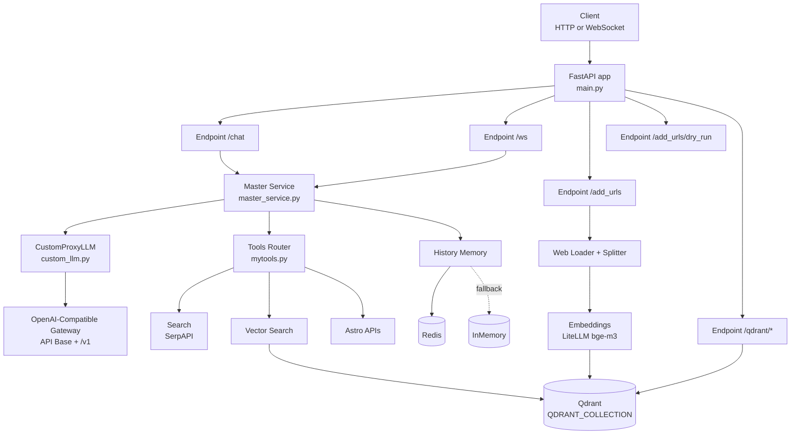

# Chatbot Agent 技术文档

## 项目概览

这是一个基于 FastAPI + LangChain 的占卜/问答 Agent 服务，支持：

1. HTTP 与 WebSocket 双通道对话
2. 工具调用（占星、联网搜索、向量检索、自检）
3. 会话记忆（Redis 优先，失败自动降级进程内内存）
4. URL 学习入库（抓取、切块、向量化、写入 Qdrant）
5. 健康检查、Qdrant 运维接口、结构化日志

---

## 目录

1. 架构总览
2. 接口清单
3. 核心流程
4. 配置规范
5. 方法手册
6. 测试与回归
7. 需求改造执行模板
8. 项目架构图

---

## 架构总览

### 服务器端

1. 技术栈：Python + FastAPI + LangChain + Qdrant + Redis
2. 核心模块：
   - app/main.py：API 入口、学习入库、Qdrant 管理接口
   - app/services/master_service.py：Agent 编排、工具路由、记忆管理
   - app/llm/custom_llm.py：OpenAI 兼容网关封装（支持 tool calls）
   - app/tools/mytools.py：工具实现（搜索、向量检索、占星、自检）
   - app/services/qdrant_service.py：Qdrant 初始化、重建、健康检查
3. 存储：
   - 向量库：Qdrant（远程 URL 或本地文件）
   - 记忆：Redis（不可用时降级进程内内存）

### 客户端

1. 用户请求进入 /chat 或 /ws
2. 系统执行情绪识别并设定角色语气
3. Agent 根据意图自动选取工具
4. 工具结果回填给模型生成最终回答
5. 以 session_id 隔离多会话

### 能力列表

1. 对话服务：HTTP + WebSocket
2. 工具编排：占星、搜索、向量检索
3. 学习能力：URL 抓取 + 切块 + 向量写入
4. 记忆能力：会话历史压缩与回放
5. 运维能力：健康检查、Qdrant 接口、日志追踪

---

## 接口清单

| 接口 | 方法 | 说明 |
| --- | --- | --- |
| /chat | POST | 主对话接口 |
| /ws | WebSocket | 实时会话通道 |
| /add_urls | POST | 从 URL 抓取并写入向量库 |
| /add_urls/dry_run | POST | URL 抓取与切块预览（不写库） |
| /add_pdfs | POST | 占位接口（待扩展） |
| /add_texts | POST | 占位接口（待扩展） |
| /health | GET | 服务健康检查 |
| /memory/status | GET | 会话记忆状态 |
| /qdrant/init | POST | 初始化集合 |
| /qdrant/recreate | POST | 删除并重建集合 |
| /qdrant/health | GET | Qdrant 连通性检查 |
| /qdrant/collections | GET | 列出集合 |
| /qdrant/status | GET | Qdrant 仓库状态（轻量监视） |

说明：当 ENV=prod 时，仅暴露 /chat；其余 HTTP/WebSocket 接口返回 Not Found。

### add_urls 输入示例（支持 Query 与 JSON）

1. JSON 方式（推荐）

```json
{
  "urls": ["https://example.com/a", "https://example.com/b"],
  "chunk_strategy": "balanced",
  "chunk_size": 900,
  "chunk_overlap": 120
}
```

2. Query 方式

```http
POST /add_urls?url=https://example.com/a&chunk_strategy=balanced&chunk_size=900&chunk_overlap=120
```

3. Query 方式传多个 urls（重复键）

```http
POST /add_urls?urls=https://example.com/a&urls=https://example.com/b&chunk_strategy=article
```

4. dry_run JSON 方式

```json
{
  "url": "https://example.com/a",
  "chunk_strategy": "faq",
  "preview_limit": 2
}
```

5. dry_run Query 方式

```http
POST /add_urls/dry_run?url=https://example.com/a&chunk_strategy=faq&preview_limit=2
```

### add_urls 语义与错误约定

1. JSON 与 Query 同名字段冲突时，优先使用 JSON。
2. url 与 urls 可混用，系统自动合并并过滤空白项。
3. dry_run 只预览，不写入 Qdrant。
4. 当集合向量维度与当前 Embedding 维度不一致时，返回 HTTP 409，不再自动删库重建。
5. 如需重建，请显式调用 /qdrant/recreate。

### Qdrant status 示例响应

1. 本地模式

```json
{
  "code": 200,
  "data": {
    "ok": true,
    "mode": "local",
    "collections_count": 1,
    "collections": ["divination_master_collection"],
    "qdrant_path": "./qdrant_data/qdrant.db",
    "db_exists": true,
    "db_size_bytes": 1048576
  }
}
```

2. 远程模式

```json
{
  "code": 200,
  "data": {
    "ok": true,
    "mode": "remote",
    "collections_count": 2,
    "collections": ["divination_master_collection", "docs"],
    "qdrant_url": "https://qdrant.example.com"
  }
}
```

---

## 核心流程

### 对话流程（/chat 与 /ws）

1. 校验 session_id。
2. 识别情绪（规则优先，LLM 兜底）。
3. 根据意图路由选择最小工具集。
4. 组装 Prompt + Memory，执行 Agent。
5. 记录工具调用轨迹并返回结果。
6. 占星场景若总结失败，启用工具结果兜底摘要。

### 学习流程（/add_urls）

1. 归一化请求参数（支持 JSON 与 Query）。
2. 按 chunk_strategy 构建切块配置。
3. 用 WebBaseLoader 抓取页面内容。
4. 文本切块并写入 metadata。
5. 初始化 Embeddings 与 Qdrant collection。
6. 写入向量点，返回统计信息与失败 URL。

### 预览流程（/add_urls/dry_run）

1. 参数归一化与切块配置。
2. 抓取并切块。
3. 返回 chunk 数量、失败项、预览样本。

---

## 配置规范

### LLM 网关

1. OPENAI_API_KEY：必填。
2. OPENAI_API_BASE：期望不包含 /v1，例如 https://api.example.com。
3. OPENAI_MODEL：必填。
4. 运行时会自动拼接 /v1/chat/completions。

### Embeddings

1. EMBEDDINGS_MODEL：LiteLLM 中配置的 embedding 模型别名，默认 bge-m3。
2. EMBEDDINGS_DIMENSION：向量维度（正整数，可选）。
3. OPENAI_EMBEDDINGS_API_BASE：可选，embedding 专用网关地址；未配置时回退 OPENAI_API_BASE。
4. RERANK_ENABLED：是否启用检索后重排，默认 true。
5. RERANK_MODEL：LiteLLM 中配置的 rerank 模型别名，默认 bge-reranker。

### Qdrant（已统一单集合）

1. QDRANT_COLLECTION：唯一集合名，/add_urls 与 vector_search 使用同一集合。
2. QDRANT_URL：远程 Qdrant 地址（可选）。
3. QDRANT_API_KEY：远程鉴权（可选）。
4. QDRANT_DB_PATH：本地模式路径，默认 ./qdrant_data/qdrant.db。
5. QDRANT_DISTANCE：cosine 或 dot 或 euclid（默认 cosine）。

### 记忆与运行时

1. REDIS_URL 或 REDIS_HOST/PORT/DB/PASSWORD。
2. MEMORY_TTL：会话历史过期时间。
3. MEMORY_COMPACT_MESSAGE_COUNT：触发历史压缩阈值。
4. MOOD_TIMEOUT_SECONDS：情绪识别超时。

### 抓取与启动检查

1. WEB_LOADER_VERIFY_SSL：是否启用网页抓取 SSL 校验。
2. EMBEDDINGS_STARTUP_CHECK：LiteLLM embedding/rerank 启动前自检开关。
3. ADD_URLS_WRITE_ENABLED：生产环境是否允许 /add_urls 入库，默认 false（需显式设为 true 才可写库）。
4. ADD_URLS_FETCH_TIMEOUT_SECONDS：单个 URL 抓取超时秒数，默认 10。
5. ADD_URLS_FETCH_RETRY_COUNT：单个 URL 的失败重试次数，默认 2。
6. ADD_URLS_FETCH_BACKOFF_SECONDS：重试退避基准秒数，默认 1。
7. ADD_URLS_MAX_CONTENT_CHARS：单个页面正文最大保留字符数，默认 20000。
8. /add_urls 与 /add_urls/dry_run 会阻断私网/环回/链路本地地址，以及疑似内网主机名（如 redis）。
9. 被拦截 URL 会返回机读 code（如 BLOCKED_PRIVATE_IP、BLOCKED_LOOPBACK、BLOCKED_LINK_LOCAL、BLOCKED_INTERNAL_HOST）。

### 占星接口本地连通性（Windows curl）

1. POST `mySign/{uid}`：必须传 JSON body（birth_dt/longitude/latitude）。
2. POST `chart/natal`：必须传 JSON body，PowerShell 建议用 here-string 或文件避免转义问题。

示例（PowerShell）：

```powershell
$body = @'
{"birth_dt":"1999-10-17 21:00:00","longitude":116.4074,"latitude":39.9042}
'@

curl.exe -sS -X POST "https://cloud.apiworks.com/open/astro/mySign/$env:ASTRO_UID" `
  -H "X-App-Id: $env:XINGPAN_APP_ID" `
  -H "X-App-Key: $env:XINGPAN_APP_KEY" `
  -H "Content-Type: application/json" `
  --data-binary $body
```

---

## 方法手册

### main.py 关键方法

#### _resolve_add_urls_payload

1. 目的：统一 JSON + Query 输入。
2. 实现：同名字段 JSON 优先，空 url 视为未提供。
3. 依赖：FastAPI Body/Query，AddUrlsRequest。

#### _build_chunking_config

1. 目的：生成切块策略配置。
2. 实现：内置 balanced/faq/article/custom 默认值并支持覆盖。
3. 依赖：RecursiveCharacterTextSplitter。

#### _collect_chunks_from_urls

1. 目的：批量抓取并切块。
2. 实现：逐 URL 处理，失败收集到 failed_urls。
3. 依赖：WebBaseLoader，_chunk_documents。

#### _build_embeddings_client

1. 目的：创建 Embeddings 客户端。
2. 实现：统一通过 LiteLLM `/v1/embeddings` 调用 bge-m3。
3. 依赖：LiteLLMEmbeddings 适配层。

#### _ensure_qdrant_collection

1. 目的：确保集合存在且维度匹配。
2. 实现：存在则检查维度，不匹配抛 VectorSizeMismatchError。
3. 依赖：QdrantClient，_extract_collection_vector_size。

#### add_urls

1. 目的：URL 学习入库。
2. 实现：抓取、切块、建库校验、写入向量。
3. 风险控制：维度冲突返回 409，避免自动删库导致数据丢失。

#### add_urls_dry_run

1. 目的：仅预览切块效果。
2. 实现：不写库，返回预览项与统计。

### services/master_service.py 关键方法

#### _get_chat_history

1. 目的：构建会话历史来源。
2. 实现：优先 Redis，失败降级 InMemory。

#### _compact_history_if_needed

1. 目的：控制历史体积。
2. 实现：抽取用户事实 + 摘要压缩。

#### _select_tools_by_intent

1. 目的：降低工具误调用。
2. 实现：按意图返回最小工具集。

#### run

1. 目的：主编排入口。
2. 实现：会话锁、情绪识别、Agent 调用、轨迹记录、兜底输出。

### llm/custom_llm.py 关键方法

#### _normalize_base_url

1. 目的：规范 OPENAI_API_BASE（输入不含 /v1）。
2. 实现：去尾斜杠并剥离末尾 /v1。

#### _request_completion

1. 目的：发起模型请求并解析 tool calls。
2. 实现：重试 429/5xx，分层处理超时与网络错误。

### tools/mytools.py 关键方法

#### _get_vector_retriever

1. 目的：向量检索器惰性单例初始化。
2. 实现：双检锁 + Qdrant + Embeddings。
3. 约束：读取 QDRANT_COLLECTION，与 /add_urls 保持一致。

#### vector_search

1. 目的：检索知识库内容。
2. 实现：retriever.invoke，拼接命中文本返回。

#### _request_astro_api

1. 目的：统一占星接口调用与错误码。
2. 实现：封装 GET/POST 与超时、HTTP 错误处理。

---

## 测试与回归

### 当前测试状态

1. 已执行 pytest。
2. 用例结果：9 passed。

### 回归建议

1. /add_urls 与 vector_search 的同集合联调。
2. 维度不匹配时验证 HTTP 409 返回结构。
3. OPENAI_API_BASE 在含 /v1 与不含 /v1 两种输入下都应正确。
4. Redis 不可用时 memory 自动降级验证。

---

## 需求改造执行模板

1. 需求三元组：入口层（API）- 资源层（文案/配置）- 引用层（逻辑/测试/文档）。
2. 影响分析：梳理调用链、配置项、兼容性风险。
3. 代码修改：按层次修改，保持返回结构稳定。
4. 回归检查：HTTP/WS 一致性、日志可观测性、错误码稳定性。

---

## 项目架构图



---

## 附录 A：运维部署最小清单

### A.1 最小环境变量（生产可用基线）

1. OPENAI_API_KEY：模型网关密钥。
2. OPENAI_API_BASE：网关地址，不包含 /v1。
3. OPENAI_MODEL：模型名。
4. QDRANT_COLLECTION：唯一集合名（学习与检索共用）。
5. QDRANT_URL（远程模式）或 QDRANT_DB_PATH（本地模式）。
6. EMBEDDINGS_MODEL：LiteLLM embedding 模型别名（默认 bge-m3）。
7. EMBEDDINGS_DIMENSION：Embedding 维度。
8. RERANK_ENABLED/RERANK_MODEL：检索重排开关与模型（默认 bge-reranker）。
9. REDIS_URL（推荐）或 REDIS_HOST/REDIS_PORT/REDIS_DB/REDIS_PASSWORD。

### A.2 启动前检查

1. 确认 OPENAI_API_BASE 不带 /v1。
2. 确认 QDRANT_COLLECTION 已配置且与预期一致。
3. 确认 LiteLLM 的 bge-m3 与 bge-reranker 模型在 `litellm/config.yaml` 中可用。
4. 若使用 Docker，确认网络能访问模型网关、Qdrant、Redis。
5. 确认日志目录可写（默认 ./logs）。

### A.3 上线后验收

1. GET /health 返回 healthy。
2. GET /qdrant/health 返回 ok。
3. POST /add_urls/dry_run 返回 chunk_preview。
4. POST /add_urls 写入成功并返回 chunks > 0。
5. 对同一问题调用 vector_search，确认能检索到刚写入内容。
6. GET /memory/status?session_id=demo，确认会话可读。

---

## 附录 B：故障排查手册

### B.1 add_urls 返回 409（向量维度冲突）

现象：接口返回 HTTP 409，提示 collection vector size mismatch。

处理步骤：

1. 查看当前 EMBEDDINGS_DIMENSION。
2. 查看目标集合维度（Qdrant 控制台或 API）。
3. 选择其一：
   - 调整 EMBEDDINGS_DIMENSION 与集合一致。
   - 调用 /qdrant/recreate 重建集合（会清空该集合数据）。

### B.2 add_urls 报 500（向量写入失败）

常见原因：

1. Qdrant 不可达或鉴权失败。
2. Embedding 网关不可达或密钥无效。
3. URL 抓取成功但写入阶段异常。

排查顺序：

1. 先查 /qdrant/health。
2. 再查日志中的 HTTP 状态码与错误详情。
3. 用 /add_urls/dry_run 验证抓取与切块是否正常。

### B.3 OPENAI_API_BASE 配置错误

现象：模型请求出现 404 或路径异常。

规则：

1. 环境变量只写网关根路径，例如 https://api.edgefn.net。
2. 代码会自动拼接 /v1/chat/completions（LLM）与 /v1（Embeddings）。

### B.4 Redis 不可用导致记忆失效

现象：服务可用，但会话记忆不持久。

说明：

1. 系统会自动降级到进程内内存，重启后历史丢失。
2. 可通过 /memory/status 查看 memory_backend 字段确认当前后端。

### B.5 vector_search 检索不到新数据

重点检查：

1. /add_urls 与 vector_search 是否使用同一个 QDRANT_COLLECTION。
2. 是否写入到不同 Qdrant 实例（URL/本地路径不一致）。
3. 是否因为集合重建导致历史数据被清空。

---

## 附录 C：Windows 常用运维命令

### C.1 运行测试

```powershell
C:/ProgramData/anaconda3/envs/agentenv/python.exe -m pytest
```

也可以直接使用仓库内固定入口（推荐）：

```powershell
./run_tests.ps1 -q
```

```cmd
run_tests.cmd -q
```

### C.2 仅查看 Qdrant 相关日志（容器场景）

```powershell
docker logs qdrant --tail 200
```

### C.3 检查 8000 端口监听

```powershell
Get-NetTCPConnection -State Listen -LocalPort 8000 -ErrorAction SilentlyContinue |
  Select-Object LocalAddress, LocalPort, OwningProcess, State
```

### C.4 检查 6379 是否暴露到宿主机

```powershell
Get-NetTCPConnection -State Listen -LocalPort 6379 -ErrorAction SilentlyContinue |
  Select-Object LocalAddress, LocalPort, OwningProcess, State
```
